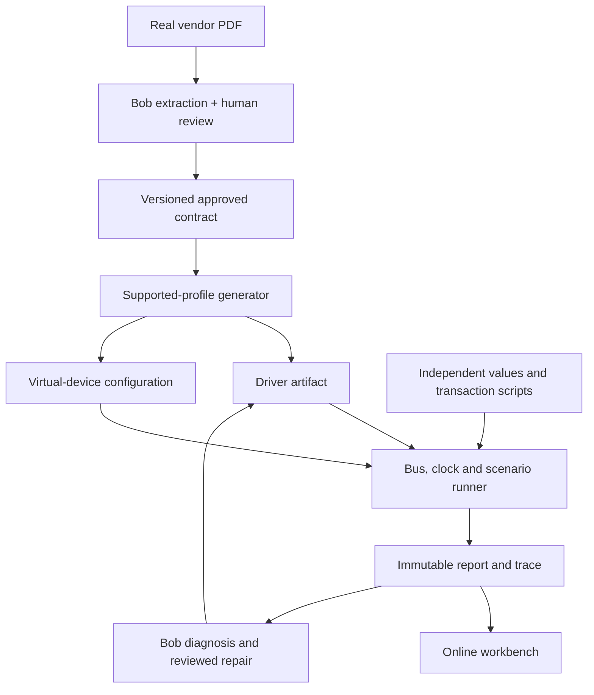

# DRIFT — Start-to-finish build playbook

**Datasheet-to-Driver Virtual Verification Lab**  
Current plan: September 26, 2026. Owner: Kimberly Heard / team DRIFT.  
Primary device: real TI TMP117. Extension: real Bosch BME280.  
Event deadline: Sunday September 27, 11 AM America/New_York; target submission: 9 AM.

## Read this first

You have Bob IDE and Bob Shell installed. This kit supplies the current architecture, candidate facts, fixed arithmetic examples, ordered Bob prompts, environment helpers, and presentation plan. The application is **not implemented yet**. The decoder example is an educational script, not the DRIFT driver or simulator. No Bob task, review approval, passing project suite, deployed application, or repair recording is claimed by this kit.

Open `START_HERE.md` for the first actions. Work through `prompts/BOB_TASKS.md` one task at a time. Use this playbook as a reference while Bob builds. You do not need to finish reading it before taking the first action.

The selected TMP117 profile remains **one-shot conversion, no averaging, 7-bit I²C address 0x48**. The full target includes four faults, a seeded driver defect, independent checks, a real Bob repair, artifact generation, an online workbench, and submission materials. BME280 follows a complete TMP117 path and reuses the infrastructure. One recorded repair is the core requirement; a second mutant makes a useful additional verification check.

## 1. What you are making, in plain language

An embedded developer normally reads a manufacturer's datasheet, identifies registers and bit fields, writes a driver, connects a board, and debugs mistakes. Some bugs only appear during rare failures. The board might not have arrived yet.

DRIFT gives that developer a repeatable way to check selected digital behavior earlier:

1. Bob reads the relevant real datasheet sections and proposes structured facts with page references.
2. You compare the facts with the document and approve a small, explicit contract.
3. A supported-profile generator emits driver source and virtual-device configuration from that approved contract and an audited template.
4. A virtual device responds to the driver's register requests and advances on a deterministic clock.
5. Independently prepared expected values and transaction scripts check the result.
6. A workbench shows what happened, which facts and tests apply, and the raw bus trace.
7. When a deliberately broken driver fails, Bob uses that evidence to diagnose and repair it. The expected answers remain fixed during this experiment.

The delivered product is a **verification workbench plus a reusable Bob workflow**. Its artifacts are the reviewed contract, generated source/configuration, executable scenarios, tests, traces, reports, and documented repair.

### Terms you need to understand

| Term | Meaning in DRIFT |
|---|---|
| Datasheet | The manufacturer's technical document describing a real component. |
| Register | A small numbered location the driver reads or writes to communicate with the sensor. |
| Driver | Software that turns operations such as “measure temperature” into those reads and writes. |
| I²C address | The device's number on the bus. The API uses the unshifted seven-bit number `0x48` (decimal 72). A wire address byte would also include a read/write bit; it is not the API address. |
| One-shot | Ask for one conversion; read its result; the device returns to shutdown. |
| No averaging | Use one conversion result rather than combining a batch of conversions. This keeps one reviewed operating profile. |
| Contract | Structured facts, selected behavior, provenance, and policies that define exactly what this prototype supports. |
| Virtual device | Software that models those selected register/state behaviors. It does not simulate electrical signals, thermal physics, or the entire chip. |
| Oracle | Independently checked expected answers used to decide whether a result is correct for a fixture. |
| Fault | A simulated environmental failure such as a device not acknowledging or never becoming ready. |
| Mutant / seeded defect | An intentionally wrong version of driver code, such as decoding bytes in the wrong order. |
| Trace | The ordered record of reads, writes, returned bytes, virtual times, and outcomes. |
| Bob task | A saved unit of work in Bob's chat, with its conversation, actions, and usage summary. |

### What makes this repeatable

The repeated activity is the developer workflow: extract → review → implement → verify → diagnose → repair → report. The runner, bus interface, clock, report schema, UI, provenance records, and session prompts are shared. A new device adds a device-specific contract, driver/template, virtual model, and independent expected values. Changing a fact invalidates its approval and creates a new artifact version; rerunning a scenario uses the same recorded inputs.

BME280 is evidence that this structure extends to another real device. Its compensation and byte layouts differ from TMP117, so its adapter must contain actual new behavior. Two device names attached to identical temperature-decoder logic would not demonstrate reuse properly.

## 2. Astra, Luna, Bob, and your responsibilities

Use **Astra in this conversation** for architecture, source interpretation, reviewing difficult failures, and judging scope. Use Luna for small tasks with clear inputs and acceptance checks, such as tightening text or formatting a table. This is a workload recommendation; neither model is a correctness guarantee. These are OpenAI model names, not the documented Bob mode selector.

Use **Bob IDE** for the primary repository work and capture it: evidence extraction, module implementation, tests, generator, UI wiring, diagnosis/repair, and final review. Use its documented **Plan**, **Agent**, and **Ask** modes. Plan establishes a bounded implementation approach; Agent edits files/runs tools; Ask explains or reviews. One task can change modes. A separate task is useful when the deliverable or ownership changes, not for every message.

Bob Shell is optional in this hackathon. Keep the central tasks in the IDE so their required summaries are easy to capture. The workbench can run without a Bob API key: it executes the already reviewed/generated artifacts, while the actual Bob extraction and repair happen in your development workspace and are shown in the recording. A runtime “Ask Bob” button requires a separately implemented supported integration; it is not part of this plan.

| Person/tool | Owns |
|---|---|
| You | Scope, datasheet review, accepting patches, interpreting results, final presentation and submission. |
| Bob IDE | Primary implementation and repair tasks, actual test runs, review suggestions, task summaries. |
| This conversation | Planning, technical explanation, secondary review, troubleshooting, wording, scope decisions. Disclose any code contributed here. |
| Husband | Rehearsal feedback and presentation support within event team/contribution rules. If he authors entry assets as a contributor, verify registration/team eligibility first; all team members must register independently. |

No two coding sessions should edit the same files at once. If you use Bob's subagents later, give them disjoint folders and a frozen interface. Start sequentially until the first complete TMP117 run exists.

## 3. Setup: from installed IDE to working repository

### A. Open the kit locally

1. Download and extract `DRIFT_Launch_Kit.zip` on your Windows machine. Move the extracted `DRIFT_Launch_Kit` folder somewhere easy to find, such as Documents. Open that folder in Bob with **File → Open Folder**. The ZIP omits Git history; initialize it on your machine below.
2. Sign into Bob IDE with the hackathon registration account. Verify the assigned organization/team in Settings. Your known organization was `ibm-coding-challenge-2` (us-east), with team `ibm-hackathon-lablab`; use your actual invitation/selector, not a sample suffix from a guide.
3. Check your version and Bobcoins. The guide says v2.0.2 or later if upgrading from v2.0.0, and allocates 40 Bobcoins with no extra event allocation after exhaustion. Record the actual balance; do not assume this kit consumed Bobcoins.
4. If the chat panel is hidden, use `Ctrl+Alt+B` on Windows.
5. Open **Terminal → New Terminal** in Bob. Start with read auto-approval; review requested writes/commands as you learn the workspace. Do not enable unrestricted commands merely to speed up setup.

### B. Verify tools and initialize

Run these in the extracted root in PowerShell, one line at a time:

```powershell
py --version
git --version
py scripts/doctor.py
git init -b main
py -m venv .venv
.\.venv\Scripts\python.exe -m pip install -e ".[dev]"
.\.venv\Scripts\python.exe examples/decode_walkthrough.py
```

Use Python 3.11 or newer. If `py` is absent but `python --version` works and reports 3.11+, substitute `python` for `py`. If neither works, install Python from [python.org](https://www.python.org/downloads/) and reopen Bob. Install Git from [git-scm.com](https://git-scm.com/downloads) if needed. Node is needed only when Bob implements the Next.js UI. Ask Bob to report installed versions and pin the dependencies it actually resolves.

Using `.venv\Scripts\python.exe` directly avoids PowerShell activation-policy problems. The example should display eight correct decodings, a byte-swap mismatch, and a sign-extension mismatch. These are example checks only, not the application's test results.

If you are on macOS/Linux instead, use `python3` in place of `py`, create the environment with `python3 -m venv .venv`, and use `.venv/bin/python` in place of `.\.venv\Scripts\python.exe`. The remaining project steps are the same.

### C. Create the public GitHub remote

1. On GitHub, choose **New repository**.
2. Name it `drift-datasheet-verification`, choose **Public**, and leave initial README/license/gitignore additions off because this kit already contains project files.
3. Click Create and copy the actual HTTPS repository URL.
4. In Bob's terminal run `git status` and inspect the staged files. Vendor PDFs, `.env`, tokens, and virtual environments must be ignored.
5. Run `git add .` and `git commit -m "Initialize DRIFT planning and development scaffold"`. If Git asks for author identity, configure the name and public/noreply email you want in commits; do not expose a private address by accident.
6. Run `git remote add origin YOUR_COPIED_REPOSITORY_URL`, replacing that entire placeholder, then `git push -u origin main`. Complete GitHub's normal sign-in prompt. A remote has not been created by this download.

Preserve `PROVENANCE.md`: the September 20 planning existed before the event; this updated kit was prepared September 26. New application work must have its actual author/tool and date. The current general guide permits many starters, while event-specific instructions take precedence. Disclose existing planning rather than relabeling it as new implementation.

### D. Obtain the real source

```powershell
.\.venv\Scripts\python.exe scripts/fetch_sources.py --device tmp117
```

The helper downloads the vendor PDF to ignored `local_sources/`, checks for a PDF header, and records the SHA-256 locally. It never approves the content. Open the PDF in a viewer and attach it to Bob or reference the local file using the IDE's file context controls. If download fails, use the official source link in section 5, save as `local_sources/tmp117.pdf`, then rerun the helper with `--offline` to record its hash.

### E. First Bob action

Read `AGENTS.md` with Bob. Run `/init` if useful to initialize Bob's project rules; require it to preserve these project invariants. Then paste Task 01 from `prompts/BOB_TASKS.md`. Use the named prompt file with an @ mention if supported, or paste its text. Follow with Task 02; that is where you inspect and approve the source facts.

## 4. Overall architecture



### Stack and boundaries

Keep the prior proposed stack: **Python + pytest + Pydantic**, then **FastAPI + TypeScript/Next.js**. Core logic remains independent of web frameworks. Use one backend service and one frontend; no database, accounts, vector database, queues, custom MCP service, or runtime LLM is needed for the core demo.

| Component | Responsibility | Dependability rule |
|---|---|---|
| `contracts/` | Candidate facts and approval records | Approval covers a canonical content hash, source hash, scope, and policies. Changes require review again. |
| `src/drift/contracts.py` | Parse and validate contract | Missing provenance, unresolved facts, or unknown semantics fail explicitly. |
| `src/drift/generator.py` + `templates/` | Emit Python driver + model config + manifest | Only registered device/profile templates; stable output for stable inputs. |
| `src/drift/bus.py` | Addressed reads/writes | Seven-bit address; reads return exact bytes or typed errors. |
| `src/drift/clock.py` | Integer microsecond clock | Virtual time is advanced explicitly; no real sleeps in simulation. |
| `src/drift/devices/tmp117.py` | Selected TMP117 state machine | Reads have modeled side effects; data-ready returned before it is cleared. |
| `src/drift/drivers/tmp117.py` | Identify, configure, trigger, wait, decode | Reads only through bus/clock interfaces; never reads simulator state. |
| `src/drift/scenarios.py` | Validated fixture/fault definitions | A new device/bus/clock per run; one injected fault per core scenario. |
| `src/drift/runner.py` | Execute known variants and collect assertions | Bounded operations and time; infrastructure errors separate from device outcomes. |
| `src/drift/reporting.py` | Assemble immutable report | Reports preserve expected and observed values, raw trace and provenance. |
| `tests/oracles/` | Fixed independent expected values | No import from production decoder, generator, or virtual model to compute expectations. |
| `src/drift/api.py` | Thin FastAPI routes | Calls core services; no duplicated device math or simulation in API. |
| `web/` | Workbench | Renders reports; clicking/refreshing a trace cannot read the live device. |

### Stable interfaces Bob should implement

```python
class RegisterBus(Protocol):
    def read_register(self, address_7bit: int, register: int, length: int) -> bytes: ...
    def write_register(self, address_7bit: int, register: int, payload: bytes) -> None: ...

class Clock(Protocol):
    def now_us(self) -> int: ...
    def advance_us(self, delta_us: int) -> None: ...

class SensorDriver(Protocol):
    def identify(self) -> DeviceIdentity: ...
    def configure(self) -> None: ...
    def measure(self, timeout_us: int) -> Measurement: ...
```

These are proposed interface signatures, not runnable source. `Measurement` includes raw bytes, interpreted value/unit, and virtual observation time. A `DeviceAdapter` registry connects a profile ID to its driver, model, template and scenarios. Introduce this thin registry after TMP117 works; avoid inventing a universal register language before seeing the second device.

Use typed outcomes: `BusNackError`, `DeviceIdentityError`, `ProtocolReadError`, `ConversionTimeout`, `UnsupportedProfile`, `ExecutionLimitExceeded`. An error never becomes a fabricated temperature.

### Report contract

Each report contains:

- `schema_version`, `run_id`, `scenario_id`, `profile_id`, selected `driver_variant`;
- contract/source/oracle/driver hashes and generator version, plus code commit if available;
- raw fixture bytes and conversion-delay policy;
- `execution_status` (completed/infrastructure_error) and observed device outcome;
- assertion records with `id`, `expected`, `actual`, `passed`, source fact IDs and trace indices;
- `verification_status` (pass/fail/unsupported) and `expected_behavior_observed`;
- an ordered trace with integer virtual microseconds, operation, address, register, bytes and outcome;
- separate wall duration, limitations and links to actual Bob evidence.

For an injected timeout, the sensor outcome is an error, but the check “driver raises the required timeout” can pass. For the byte-swap mutant, a numeric assertion fails and the comparison screen says “seeded defect detected.” Preserve both facts instead of collapsing everything into one green indicator.

### Proposed API

| Route | Purpose |
|---|---|
| `GET /health` | Service availability and version. |
| `GET /profiles` | Implemented profiles, scopes, approval status. |
| `GET /profiles/{id}` | Facts, review metadata and source links. |
| `POST /artifacts` | Generate from a known approved contract hash. |
| `POST /runs` | Run an allowlisted profile/scenario/driver variant. |
| `GET /runs/{id}` | Return report and trace. |
| `GET /runs/{id}/report` | Download JSON. |

Human approval is a local authoring action. The public demo displays approved snapshots and a known draft example to demonstrate blocking; it does not let anonymous visitors rewrite the authoritative contract. Known-ID validation prevents arbitrary paths. Scenario errors are valid report outcomes; a backend crash is not a sensor timeout.

### Execution limits

Proposed initial policies: 250,000 microseconds maximum virtual time, 1,000 bus operations, bounded trace length, and a 2-second wall watchdog for isolated mutant runs. Tune to the real host. A loop that never advances time needs an operation bound or process watchdog; virtual time alone cannot stop it. Only run reviewed, allowlisted variants online. Keep infinite-loop mutation testing local if the host cannot isolate it safely.

## 5. Source documents and review queue

### TMP117: the primary real device

Official PDF: https://www.ti.com/lit/ds/symlink/tmp117.pdf  
Document: SNOSD82D, Rev. D, September 2022. Current PDF checked September 26.  
Earlier recorded hash (recompute locally): `b33614678dd46e7997f813ccefb118796dcbcc97c9ba264806703ee453a3d555`.

The kit's facts are candidates until **you** review the source copy and record approval. Printed pages below are one-based; PDF screenshot index is page minus one.

| ID | Candidate fact | Review location |
|---|---|---|
| F01 | ADD0 grounded selects seven-bit address `0x48`. | p21, Table 7-2 |
| F02 | Two-byte words transfer MSB first. | p20, §7.5.3.1 |
| F03 | Temperature/configuration/device-ID registers: `0x00`, `0x01`, `0x0F`. | p25 |
| F04 | Signed 16-bit two's-complement temperature; one count = 1/128 °C; reset result `0x8000`. | p26, §7.6.2 |
| F05 | Reset configuration `0x0220`; ready `0x2000`; mode mask `0x0C00`; averaging mask `0x0060`. | p27, Table 7-6 |
| F06 | Mode `01` shutdown, `11` one-shot; averaging `00` selects one conversion. | p27 |
| F07 | Reading configuration or temperature clears data-ready; completion sets it. | p27 |
| F08 | One-shot returns to shutdown; CONV bits do not determine one-shot duration. | pp14–15, §7.4.3 |
| F09 | Single-conversion timing min/typ/max 13/15.5/17.5 ms under stated conditions. | p6 |
| F10 | Lower 12 bits of device ID identify `0x117`; upper nibble is revision. | p32, §7.6.11 |

Your selected operating profile, pending source-contract approval: `0x48`, one-shot/no averaging, initialized shutdown fixture. **100 ms timeout and 1 ms polling are DRIFT policies**. Initial fixture config `0x0600` is derived from selected settings, not the factory reset word. At the default 15.5 ms virtual conversion delay, 1 ms polling observes completion at 16 ms.

Fixed arithmetic examples are in `tests/oracles/tmp117_vectors.json`. They include `0C 80` → 25 °C and `FF 80` → -1 °C. The independent check for the former is 3,200 / 128; for the latter it is (65,408 - 65,536) / 128. The decoder can arithmetically decode `80 00` to -256 °C, while the measurement workflow must not present the initial reset value as a completed measurement.

### BME280: bounded extension

Official PDF: https://www.bosch-sensortec.com/media/boschsensortec/downloads/datasheets/bst-bme280-ds002.pdf  
Current cover: revision 1.24, February 2024, BST-BME280-DS001-24. Some inner page footers still say revision 1.23; record the cover identity and whole-file SHA-256 rather than silently merging versions.

Extension profile: **I²C `0x76`, forced temperature measurement, temperature oversampling ×1, pressure/humidity skipped, filter off, initialized sleep after NVM copying**. This is a selected temperature-only demonstration of a multi-sensor component.

| Evidence to review | Location in current PDF |
|---|---|
| Forced measurement returns to sleep | pp14–16, §3.3 |
| Temperature oversampling | p17; p29, Table 24 |
| Calibration byte layout and signedness | p24, §4.2.2 |
| Temperature compensation equation | p25, §4.2.3 |
| ID/status/control registers | pp27–30, §5.4 |
| Three raw temperature bytes | p31, §5.4.8 |
| I²C address selection | §6.2, verify page in your downloaded revision |
| Conversion-time formula | Appendix B / measurement-time section, verify before selecting the waiting policy |

Candidate register facts: ID at `0xD0`, status at `0xF3`, control at `0xF4`, calibration temperature bytes beginning `0x88`, raw temperature beginning `0xFA`. Review each before using it. Calibration includes unsigned `dig_T1` and signed `dig_T2/dig_T3`, stored little-endian; raw temperature uses a separate 20-bit packing rule. This gives meaningful new verification challenges.

A DRIFT arithmetic fixture may use raw ADC 519888 and calibration 27504, 26435, -1000. The datasheet's integer method yields intermediates 128793, -371, and `t_fine=128422`, with output 2508 centidegrees (25.08 °C). This is an independently calculated **chosen fixture**, not a sensor reading or a Bosch-certified golden dataset. Add more independently worked cases and optionally cross-check against a pinned revision of Bosch's official [BME280 SensorAPI](https://github.com/boschsensortec/BME280_SensorAPI), preserving its license if any source is reused.

Finish TMP117 first. BME280 reuses orchestration, schema, bus, clock, trace, report and UI. It adds its own model, calibration decoding, compensation, driver sequence, oracle, and template. A single shared byte-order flag is insufficient because its calibration and measurement layouts differ.

### Data handling

List source URLs, revision, retrieval date, hash, and intended use. Keep whole vendor PDFs in ignored `local_sources/`; publish links and concise paraphrased technical facts. Public availability is not blanket redistribution permission. The event requires permission for data use and excludes client, confidential, personal and social-media data. The scenario inputs are synthetic test fixtures for **real documented devices**, which does not make the datasheets fictional. No physical measurements or real board validation are claimed.

## 6. A complete sample run

This is the **expected walkthrough to implement**, not an execution record.

1. Bob proposes fact F04: two bytes, signed 16-bit MSB-first, scale 1/128 °C, citing p26.
2. You inspect p26 and approve F04 as part of the full reviewed contract. The approval record contains your decision, timestamp and canonical hash; Bob cannot approve on your behalf.
3. Generate actual source/configuration from the reviewed profile. Preserve the generator/template version and output hashes.
4. Select the known fixture `tmp117_25c`, raw bytes `0C 80`, default virtual completion delay 15,500 µs.
5. Driver identifies the part, prepares the selected configuration and starts one-shot. A scripted-bus test independently checks the required transaction sequence.
6. Driver polls through the bus. At 16,000 µs it receives a status snapshot containing ready. That read consumes the flag. It then reads temperature once; it must retain the earlier ready observation.
7. Returned bytes `0C 80` decode to 25 °C. The oracle contains the literal expected value 25; it is not computed by the driver's decoder.
8. Workbench shows a real report: raw bytes, expected/actual result, assertion IDs, cited source facts, contract hash and trace. Viewing the report produces no additional device reads.
9. Select a seeded byte-swap variant. The same bytes interpreted as `0x800C` become -32756 / 128 = **-255.90625 °C**, which fails the fixed 25 °C assertion.
10. Record Bob reading the failing evidence, diagnosing byte order, proposing a minimal patch, applying the accepted change, and rerunning unchanged tests.
11. Export before/after reports and preserve the actual diff and task-summary PNG. Label the defect as seeded and the repair as recorded if it is not happening live.

### Four environmental faults

| Scenario | Injected condition | Correct observable result |
|---|---|---|
| Missing device | Address read does not acknowledge | `BusNackError`; no reading |
| Never ready | Conversion never completes | `ConversionTimeout` at the declared application deadline |
| Wrong identity | Device ID's lower bits are wrong | `DeviceIdentityError` before conversion |
| Short read | Temperature read contains fewer than two bytes | `ProtocolReadError`; no partial decoding |

A sensor can also return plausible wrong bytes that this interface alone cannot distinguish from a valid sample. The workbench may detect disagreement with an independently supplied test fixture, but it must not claim universal corruption detection on physical hardware.

## 7. Bob tasks and evidence

### Required task-summary capture

The current event-specific guide supplies the concrete process:

1. In Bob IDE's chat panel, choose **Tasks**.
2. Open the relevant project task. Use **All** if tasks span workspaces.
3. Click the **task header** to display its session consumption summary.
4. Take a legible screenshot; PNG preferred.
5. Save as, for example, `bob_sessions/drift_task04_driver_summary.png`.
6. Repeat for all relevant tasks, including consequential failed attempts, and commit the images to the public repo.

The summary records usage; it does not prove correctness by itself. Also keep `docs/BOB_WORK_LOG.csv`, code commits, actual command output, reviewed decisions, and the repair clip. These additional records are our project evidence strategy. Never fabricate a Bob summary or call a screenshot of this conversation a Bob session.

### Session sequence

| Task | Mode / output | Exit condition |
|---|---|---|
| 01 Orientation/setup | Plan → Agent; environment and interfaces | Correct account, reproducible setup, root rules understood |
| 02 Source/contract | Agent + your review | Facts have evidence; approved subset has a content hash |
| 03 Decoder/oracle | Agent | Fixed vectors pass; byte/sign mistakes fail intentionally |
| 04 Driver/scripted bus | Agent | Identity, setup, bounded polling, reads checked independently |
| 05 Virtual model | Agent | Lifecycle, time and read side effects tested without production driver |
| 06 Integration/faults | Agent | Baseline plus four faults yield actual reports and stable traces |
| 07 Generation | Agent | Approved contract generates real tested artifacts and manifest |
| 08 Workbench/deploy | Plan → Agent | Judge operates baseline/fault/mutant and downloads actual report online |
| 09 Repair recording | Agent | Real Bob diagnosis/patch; fixed tests and hashes preserved |
| 10 BME280 extension | Plan → Agent | Only after full TMP117 loop; new facts/oracle/device adapter work |
| 11 Reproduction/review | Ask → Agent for fixes | Fresh checkout works; critical issues resolved |
| 12 Submission | Agent drafting + your verification | Assets uploaded, links tested, receipt confirmed |

The full copy/paste text for every task is in `prompts/BOB_TASKS.md`. Each task ends by updating `STATUS.md`: what exists, exact test command/output, remaining failures, current commit, and next action. Capture summaries at those boundaries.

Use `docs/BOB_WORK_LOG.csv` to track actual Bobcoin usage. Reserve a meaningful portion for repair and final review; no fixed coin-per-task prediction is reliable. If usage accelerates, shorten task context and reuse repository instructions rather than repeatedly pasting every document. Core work should remain demonstrably Bob-assisted.

## 8. Independence and reliability

The main failure to avoid is a driver and simulator that share the same mistake and therefore agree. The contract is a reviewed source of intended behavior, but implementation agreement is insufficient.

1. Hand-check source facts and the arithmetic examples.
2. Keep expected bytes/values literal in oracle files; do not import generated constants to construct expectations.
3. Check the driver against an independent scripted bus before integrating the simulator.
4. Check the virtual model directly with explicit transactions and times, without the production driver.
5. Check the integrated path against the same fixed expectations.
6. Insert meaningful semantic defects, and verify the expected assertion actually fails. A syntax or import error does not count as catching a decoding defect.
7. During the repair experiment freeze the contract/oracle/test hashes. If you discover an actual oracle error, record the correction and restart the experiment with a new baseline; never silently rewrite the expected answer.
8. Regenerate and rerun after an approved contract change. Hashes establish identity/provenance, not mathematical truth.

Add at least these edge cases within the selected scope: zero, positive and negative temperatures; one-count values; wrong byte lengths; alternate valid revision nibble; two sequential measurements; completion between poll ticks; ready clearing; repeated scenario determinism; unsupported profile request; limits catching runaway execution.

Public inputs are named fixtures/variants. A free-form raw-byte explorer can be added later, but its result is exploratory unless it has an independent expected answer. Reports must label modeled timing, unsupported behavior, and physical validation limits.

## 9. Judge workbench and deployment

### The screen a stranger sees

Header: **DRIFT — verify driver behavior before the board arrives**. A short sentence explains the supported device/profile. First action: **Run TMP117 baseline**.

Four tabs/panels:

1. **Evidence:** facts, page links, approval state, document/contract hash, scope.
2. **Artifacts:** generated files and manifest, actual Generate/Download actions, explanation of profile support.
3. **Run & trace:** device/scenario/driver selectors, Run, expected/actual assertion table, time-ordered bus log with expandable bytes.
4. **Repair & report:** preserved before/after results, seeded defect diff, Bob evidence link, repair clip and JSON export.

Keep labels specific. “Simulation: 16 ms virtual” differs from wall execution time. “Expected timeout handled” differs from a successful temperature measurement. A recorded run must say “recorded”; a live Run button must actually execute the backend.

The default guided sequence should take under two minutes: baseline → byte-swap failure → fault → repair comparison. Add a one-click reset to a known fixture. Source links and advanced trace details are available without blocking the main story. No animation or visual agent activity should pretend to show a runtime Bob call.

### Deployment order

1. Run the Python core locally and save reports.
2. Add FastAPI routes over that same code.
3. Add Next.js/TypeScript UI and test it against the API locally.
4. Deploy the complete stack to an allowed platform. The rulebook names Streamlit, Replit or Vercel. A Replit deployment can host the API plus a built static frontend; check the actual free/paid/account options before committing to a host. Do not assume free credits or compatibility.
5. For simplest single-service hosting, statically export a client-only Next.js UI and serve the output from FastAPI; no Next server actions or dynamic server routes in that variant. If static export blocks you, a Streamlit frontend importing the same core is the explicit contingency, retaining the same evidence/report/trace experience.
6. Verify the public URL signed out on another browser/device. Run baseline, fault, mutant, export. Confirm that visitors do not need your Bob account or secret.
7. Record a backup demo and keep local commands ready. A recording alone does not meet the stated interactive-URL requirement.

Ask Bob to use current official framework/platform documentation and record versions when it implements deployment. This playbook specifies boundaries rather than guessing a future provider's exact build menu.

## 10. Schedule from a 10 AM Saturday start

These are aggressive target windows, not promises that a phase fits its slot. Keep Deloitte in a protected block with enough room for its actual duration. BNSF must be completed before its confirmed Saturday 4 PM Eastern deadline.

| Eastern window | Target |
|---|---|
| Sat 10–11 AM | Repo, environment, source review and contract |
| 11 AM–2 PM | Oracle, decoder, scripted bus and driver |
| 2–5 PM | Virtual device, normal integrated run, trace |
| 5–8 PM | Four faults, generator and actual reports; fit Deloitte earlier where its full duration is protected |
| 8–11 PM | Hosted usable workbench and recorded Bob repair |
| 11 PM–Sun 2 AM | BME280 only if TMP117 loop and submission foundation work |
| Sun 2–6 AM | Stabilize, record demo, finish slides/descriptions; rest as needed |
| 6–8 AM | Fresh-checkout run, signed-out links, uploads |
| 8–9 AM | Final submit and confirmation |
| 9–11 AM | Buffer for issues, not planned features |

Your husband's presentation work can run alongside the core work if event contribution rules allow it. Draft the problem, audience, architecture and limitations slides before results exist; add actual counts/screenshots later. Keep placeholders clearly marked until replaced.

**Decision gates:** no source-reviewed decoder/scripted-bus path by 5 PM means BME280 is in serious doubt. No normal integrated TMP117 run by 9 PM means stop BME280 work. No interactive core plus repair evidence by 1 AM means freeze extension work and protect delivery. At 6 AM stop adding features and finish submission. Report actual progress at these gates; the assistant cannot see Bob's local workspace automatically.

## 11. Required submission and exact evidence inventory

Current public instructions were checked September 26. Event-specific announcements and actual form fields take precedence if they change.

| Item | Required action | File/location |
|---|---|---|
| Working prototype | Publish an interactive URL; test signed out | Submission Application URL |
| Public code | Public GitHub repo with Bob-assisted source and reproducible commands | GitHub |
| Bob evidence | All relevant IDE task consumption summaries as legible PNGs | `bob_sessions/` |
| Title | DRIFT plus descriptive subtitle | Form |
| Short description | Maximum 255 characters | Form; draft in `docs/PITCH_AND_DEMO.md` |
| Long description | At least 100 words; only completed capabilities | Form |
| Tags | Select IBM and relevant developer/testing categories offered by the form | Form |
| Cover | PNG/JPG, 16:9 to satisfy the stricter rulebook wording | `submission/cover.png` or JPG |
| Video | MP4, at most five minutes; introduction, slides and functionality | `submission/demo.mp4` |
| Slides | PDF pitch deck | `submission/slides.pdf` |
| Confirmation | Submit, then verify it is submitted; keep receipt/screenshot | Local evidence |

Recommended repository evidence beyond the official minimum: `PROVENANCE.md`, source manifest, approved contract, independent oracles, reports, test output, tool/dependency versions, model limits, work log, repair commits/diff, setup instructions, third-party notices. Preserve each third-party license; do not apply your own code license to a vendor PDF.

### Final form procedure

1. From the DRIFT team dashboard choose **Submit Project**.
2. Inspect the actual required fields before the last hour. Save a draft if supported; that is not final submission.
3. Paste final title/descriptions and select tags.
4. Upload the cover, MP4 and slide PDF. Wait for every upload to complete and preview them.
5. Enter the public GitHub URL and interactive application URL.
6. Open both in a signed-out browser and verify a run and a report download. Check the video has sound and readable text.
7. Verify the repo includes `bob_sessions/` images and actual source, not just this kit.
8. Re-read claims against implemented features. Remove unfinished BME280 claims or label them as future work.
9. Submit before the target time and confirm the entry status/receipt. Do not assume a saved draft counts.

The rulebook's six-hour manual route requires a valid reason and prior organizer/mentor approval; it is not an automatic extension. No need to wait for a perfect second device before preserving a complete entry if the portal permits updates, but first verify its editing behavior.

### Submission risks that need specific attention

- Your solo team exists; the generic “invite teammates/create Discord channel” checklist does not mean you must recruit a second person. Your dashboard explicitly requires two connected members only to create that team channel.
- Every actual team member must register independently. If your husband is unregistered, clarify the allowed presentation contribution before assigning him authored entry assets. Rehearsal feedback and organizing your workspace do not make him a technical co-builder.
- Use the assigned Bob account; keep all relevant task summaries. Shell use alone does not replace the required IDE evidence.
- Bring only permitted data. Maintain source URLs and distinguish vendor documentation from original synthetic fixture data.
- Keep old planning provenance and disclose other assistants. Never claim code produced here was produced by Bob.

## 12. Demonstration, scripts, and business story

Detailed scripts at 15 seconds, 60 seconds, three minutes and five minutes are in `docs/PITCH_AND_DEMO.md`. Use present tense only for completed capabilities.

The target audience is firmware developers integrating documented sensors while hardware access is limited. Candidate business value: fewer preventable byte/order/status mistakes reaching the bench; repeatable failure reproduction; faster handoff of driver assumptions; reusable CI regression checks. You can show exactly which seeded defects and scenarios were caught. You cannot honestly claim a universal defect rate, safety certification or a percentage time saving without measurement.

Collect actual metrics: assertions run, expected faults handled, named mutants caught, repeatability across identical fixtures, assisted task duration, and what work a second adapter reused. If no manual baseline was measured, report observed task time with context and omit percentage productivity claims.

### What would make the final entry strong

The judge can explain the problem after one sentence, operate the baseline without narration, inspect a source fact, see a failure that corresponds to a real code defect, inspect Bob's actual repair, and rerun the same expectations. A BME280 adapter shows that the workflow extends beyond one sensor, with its different compensation logic honestly scoped. The strongest evidence is connected and runnable.

## 13. When a task goes wrong

| Problem | Immediate action |
|---|---|
| Bob explains for too long | Ask for the smallest bounded implementation, exact files and one testable output; reuse the task card. |
| Bob says tests passed without output | Ask for command, exit code, output and files; verify locally. |
| Bob tries to approve source facts | Leave them pending; inspect the pages yourself and record a separate approval. |
| Driver/model agree but golden test fails | Check source interpretation and independent arithmetic; preserve the failing report. |
| Data-ready vanishes | Inspect whether an extra configuration read consumed it; render saved snapshots. |
| Environment setup stalls | Paste the first actual error here; avoid repeatedly reinstalling unrelated tools. |
| UI has disconnected demo data | Wire it to actual exported report/API; label recorded examples explicitly. |
| Bobcoins low | Finish the most consequential Bob task/repair first and preserve evidence; reduce repeated full-context prompts. |
| Hosting stalls | Move to the documented simple frontend contingency over the same Python core; keep the interactive requirement. |
| Context gets confused | Start a new task using `STATUS.md`, AGENTS and the next task card. |

### Handoff template for this chat

```text
DRIFT status: Task __. Current time __ Eastern.
What runs: __
Last command and exact output: __
Changed files/commit: __
Current failure: __
Bobcoins remaining: __
Bob summary saved: yes/no
Next intended action: __
```

## 14. Official references

- Event guide and session instructions: https://lablab-ibm-bob-2-hackathon-guide.s3.us.cloud-object-storage.appdomain.cloud/index.html
- Event/live page: https://lablab.ai/ai-hackathons/ibm-bob-2-hackathon/live
- Submission guide: https://lablab.ai/delivering-your-hackathon-solution
- Rulebook: https://lablab.ai/hackathon-rules
- Team registration/general guide: https://lablab.ai/guide
- Bob IDE quickstart: https://bob.ibm.com/docs/ide/getting-started/quickstart
- Bob modes: https://bob.ibm.com/docs/ide/features/modes
- Bob skills reference, optional: https://bob.ibm.com/docs/ide/features/skills
- TI TMP117: https://www.ti.com/lit/ds/symlink/tmp117.pdf
- Bosch BME280: https://www.bosch-sensortec.com/media/boschsensortec/downloads/datasheets/bst-bme280-ds002.pdf
- Bosch reference API: https://github.com/boschsensortec/BME280_SensorAPI
- OpenAI model choice: https://developers.openai.com/api/docs/guides/model-selection

**Provenance:** This September 26 playbook consolidates the real-device DRIFT plan developed September 20 and corrected September 25. It supersedes the old schedule and the erroneous fictional-device brief. It provides a build plan and starter utilities; it makes no claim that the full application or submission exists.
